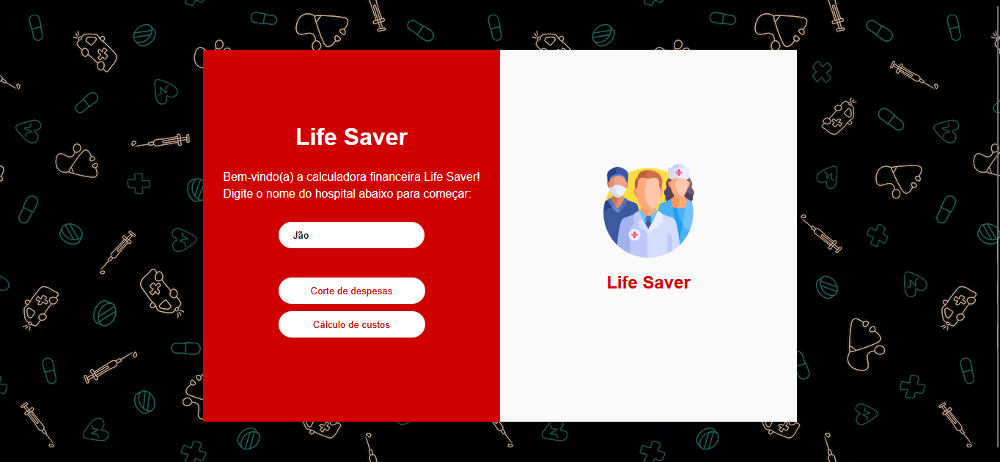

# Calculadora Financeira - Life Saver




> Esta é a calculadora financeira responsável por viabilizar o projeto Life Saver. Ela estima os custos necessários para a implementação do projeto e calcula a redução de gastos obtida com a utilização do nosso produto.


## 💻 Pré-requisitos

Antes de começar, verifique se você atende aos seguintes requisitos:

- Possuir um navegador web atualizado (Google Chrome, Mozilla Firefox, Microsoft Edge ou similar).

- Possuir um sistema operacional capaz de executar um navegador moderno (Windows, Linux ou macOS).

Este projeto não requer instalação de dependências, compiladores ou servidores locais. Basta abrir o arquivo `index.html` em um navegador.

## ☕ Usando a Calculadora Financeira - Life Saver

Para utilizar a **Calculadora Financeira - Life Saver**, siga estas etapas:

1. Clone este repositório em sua máquina:

```bash
git clone https://github.com/sptech-adsb-g1/Calculadora-Financeira.git
```

Ou, se preferir, faça o download do projeto:

- Clique no botão **Code** no repositório.
- Selecione **Download ZIP**.
- Extraia os arquivos em uma pasta no seu computador.

2.  Acesse a pasta do projeto.
3.  Abra o arquivo `index.html` em um navegador.

## 🤝 Colaboradores

Agradecemos às seguintes pessoas que contribuíram para este projeto:

<table>
  <tr>
    <td align="center">
      <a href="#" title="defina o título do link">
        <br>
        <sub>
          <b>Ezequiel Eduardo</b>
        </sub>
      </a>
    </td>
    <td align="center">
      <a href="#" title="defina o título do link">
        <br>
        <sub>
          <b>Gustavo Brun</b>
        </sub>
      </a>
    </td>
    <td align="center">
      <a href="#" title="defina o título do link">
        <br>
        <sub>
          <b>Letícia dos Santos</b>
        </sub>
      </a>
    </td>
    <td align="center">
      <a href="#" title="defina o título do link">
        <br>
        <sub>
          <b>Guilherme Camargo</b>
        </sub>
      </a>
    </td>
  </tr>
  <tr>
    <td align="center">
        <a href="#" title="defina o título do link">
          <br>
          <sub>
            <b>Kauê de Oliveira</b>
          </sub>
        </a>
      </td>
      <td align="center">
      <a href="#" title="defina o título do link">
        <br>
        <sub>
          <b>Icaro Nunes</b>
        </sub>
      </a>
    </td>
    <td align="center">
      <a href="#" title="defina o título do link">
        <br>
        <sub>
          <b>Beatriz Iwata</b>
        </sub>
      </a>
    </td>
    <td align="center">
      <a href="#" title="defina o título do link">
        <br>
        <sub>
          <b>Gabriel Filgueiras</b>
        </sub>
      </a>
    </td>
  </tr>
  <tr>
    <td align="center">
      <a href="#" title="defina o título do link">
        <br>
        <sub>
          <b>Gustavo de Souza</b>
        </sub>
      </a>
    </td>
  </tr>
</table>
